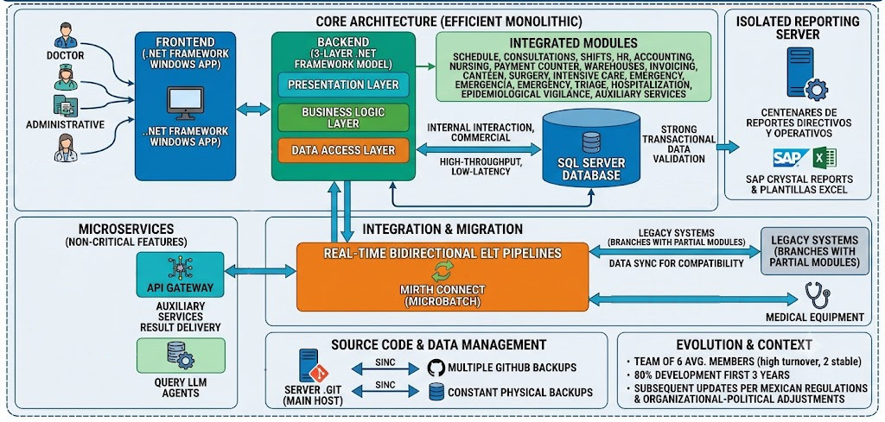

# Enterprise Hospital Information System (EHR)

> **Private Project**
>
> Due to confidentiality agreements, source code, proprietary assets, institution names, and sensitive business information cannot be shared. This document focuses exclusively on the system architecture, engineering decisions, and my technical contributions.

---

## Overview

Between 2015 and 2023, I participated in the design, development, and long-term evolution of a comprehensive Hospital Information System (EHR) deployed across multiple healthcare facilities.

The platform supported virtually every operational area of a Level III hospital, including clinical, administrative, financial, and management workflows, providing a fully digital Electronic Health Record compliant with Mexican healthcare regulations.

The project evolved continuously for more than eight years, adapting to regulatory changes, organizational restructuring, and new operational requirements while maintaining compatibility with existing legacy systems.

---

## System Scope

The platform included more than twenty integrated modules, including:

- Patient Registration
- Scheduling
- Outpatient Consultations
- Emergency Department
- Hospitalization
- Intensive Care Unit
- Surgery
- Laboratory
- Medical Imaging
- Pathology
- Pharmacy
- Inventory
- Billing
- Human Resources
- Accounting
- Epidemiological Surveillance
- Nursing
- Auxiliary Clinical Services

Hundreds of operational and executive reports were also developed to support clinical and administrative decision-making.

---

## High-Level Solution Architecture

**Core Architecture**

- Windows Desktop (.NET Framework)
- Three-layer monolithic backend
- Microsoft SQL Server
- Transaction-level database validation
- Crystal Reports Server
- Microservices for non-critical features
- Docker-based auxiliary services
- On-Premise infrastructure

The solution intentionally adopted an on-premise architecture to maximize availability and operational continuity during internet outages or external contingencies.

---

## My Contributions

Throughout the project I worked in multiple technical roles.

### Software Architect

- Designed complete business modules.
- Collaborated directly with healthcare personnel.
- Defined data models and system workflows.
- Preserved compatibility with legacy applications.

### Full Stack Developer

- Developed new modules and features.
- Implemented production hotfixes.
- Maintained existing components.
- Optimized system performance.

### Data Engineer

- Designed ETL and ELT pipelines.
- Integrated medical devices.
- Built HL7 interfaces.
- Maintained bidirectional synchronization with legacy systems.

---

## Key Technical Challenges

- Supporting continuous regulatory changes over eight years.
- Maintaining compatibility with legacy hospital software.
- Migrating across multiple SQL Server versions with minimal downtime.
- Designing highly reliable on-premise infrastructure.
- Integrating medical devices using HL7 standards.
- Developing new modules while supporting production environments.

---

## Technologies

**Languages**

- C#
- Visual Basic
- SQL
- Python
- JavaScript

**Frameworks**

- .NET Framework
- FastAPI
- Node.js

**Database**

- SQL Server
- PostgreSQL

**Integration**

- HL7
- NextGen Connect (Mirth)

**Infrastructure**

- Windows Server
- Docker
- Git

---

## Results

- Enterprise Hospital Information System used in production for over eight years.
- Successful implementation of more than twenty integrated modules.
- High system availability through multiple organizational and regulatory changes.
- Minimal impact during database engine upgrades.
- Seamless interoperability with legacy applications and medical devices.

---

## Related Case Studies

- [🔄 **Healthcare Data Integration Platform**](2-healthcare-data-integration-platform.md)
- [🤖 **Clinical RAG Assistant**](3-clinical-rag-assistant.md)
- [📊 **Clinical Risk Prediction Models**](4-clinical-risk-prediction-models.md)
- [💬 **Healthcare WhatsApp Notification Platform**](5-healthcare-whatsapp-platform.md)

[← Back to Main](../README.md)