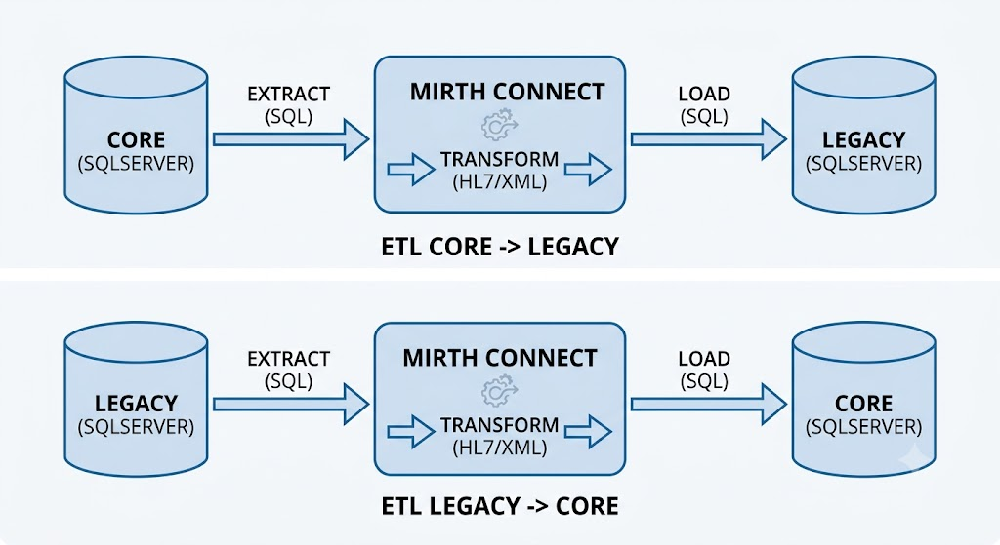

# Healthcare Data Integration Platform

> **Private Project**
>
> Due to confidentiality agreements, source code, proprietary assets, institution names, and sensitive business information cannot be shared. This document focuses exclusively on the system architecture, engineering decisions, and my technical contributions.

---

## Overview

As part of the Enterprise Hospital Information System, I designed and implemented a data integration platform responsible for synchronizing information between legacy hospital systems, the new EHR platform, and multiple medical devices.

The primary objective was to ensure data consistency across heterogeneous systems while minimizing manual intervention and maintaining uninterrupted hospital operations.

The platform evolved over several years, becoming a core component of the hospital ecosystem.

---

## Integration Scope

The platform supported multiple integration scenarios, including:

- Legacy System ↔ Enterprise EHR synchronization
- Medical Devices → Hospital Information System
- HL7 Message Processing
- Laboratory Equipment Integration
- Medical Imaging Integration
- Microbatch Data Synchronization
- Bidirectional ETL/ELT Pipelines

Several dozen integration pipelines were developed as new modules and medical services were incorporated into the platform.

---

## High-Level Architecture

**Integration Architecture**

- Legacy SQL Server databases
- Enterprise Hospital Database
- NextGen Connect (Mirth Connect)
- HL7 Interfaces
- Medical Devices
- ETL / ELT Pipelines
- Microbatch Processing

The architecture combined event-driven concepts with scheduled microbatch execution, providing a balance between reliability, performance, and operational simplicity.

---

## My Contributions

### Data Engineer

- Designed bidirectional ETL/ELT pipelines.
- Implemented healthcare data integration workflows.
- Developed HL7 interfaces.
- Built synchronization mechanisms between legacy and modern systems.

### Software Engineer

- Implemented integration services for new hospital modules.
- Designed reusable integration components.
- Optimized data transfer performance.

### Solution Architect

- Defined integration strategies.
- Designed scalable data flows.
- Maintained compatibility with legacy applications throughout the platform evolution.

---

## Key Technical Challenges

- Maintaining data consistency across multiple independent systems.
- Supporting bidirectional synchronization without data conflicts.
- Integrating heterogeneous medical devices using different HL7 message formats.
- Extending integrations as new hospital modules were developed.
- Achieving reliable synchronization while minimizing system downtime.

---

## Technologies

**Languages**

- SQL
- C#
- JavaScript

**Integration**

- NextGen Connect (Mirth Connect)
- HL7
- ETL / ELT

**Databases**

- Microsoft SQL Server
- PostgreSQL

**Architecture**

- Microbatch Processing
- Event-Driven Integration
- On-Premise Infrastructure

---

## Results

- Successful synchronization between legacy and modern hospital systems.
- Automated integration with multiple medical devices.
- Significant reduction in manual data entry.
- Reliable bidirectional communication across clinical systems.
- Scalable integration platform supporting years of continuous system evolution.

---

## Related Case Studies

- [🏥 **Enterprise Hospital Information System**](casestudies/1-hospital-information-system.md)
- [🤖 **Clinical RAG Assistant**](casestudies/3-clinical-rag-assistant.md)
- [📊 **Clinical Risk Prediction Models**](casestudies/4-clinical-risk-prediction-models.md)
- [💬 **Healthcare WhatsApp Notification Platform**](casestudies/5-healthcare-whatsapp-platform.md)
