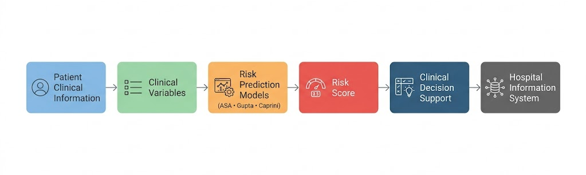

# Clinical Risk Prediction Models

> **Private Project**
>
> Due to confidentiality agreements, source code, proprietary assets, institution names, and sensitive business information cannot be shared. This document focuses exclusively on the system architecture, engineering decisions, and my technical contributions.

---

## Overview

As part of several healthcare research initiatives, I participated in the adaptation, validation, and deployment of predictive clinical models used to estimate perioperative risk.

The objective was to integrate evidence-based risk assessment directly into the Hospital Information System, allowing physicians to obtain real-time clinical decision support during patient evaluation.

Rather than developing entirely new algorithms, the project focused on adapting internationally recognized models to the local patient population and incorporating them into everyday clinical workflows.

---

## Project Scope

The solution included the implementation of several validated clinical risk assessment models, including:

- ASA Physical Status Classification
- Gupta Cardiac Risk Calculator
- Caprini Venous Thromboembolism Risk Assessment

These models were integrated into the Hospital Information System and became part of the hospitalization and surgical modules.

---

## High-Level Architecture

Patient Clinical Information
            │
            ▼
Clinical Variables
            │
            ▼
Risk Prediction Models
(ASA • Gupta • Caprini)
            │
            ▼
Risk Score
            │
            ▼
Clinical Decision Support
            │
            ▼
Hospital Information System
**Architecture Components**

- Hospital Information System
- Clinical Data Repository
- Predictive Models
- Risk Calculation Engine
- Clinical Decision Support
- Physician User Interface

Patient information collected during the clinical evaluation was processed automatically to calculate risk scores and present decision support directly within the physician's workflow.

---

## My Contributions

### Data Scientist

- Adapted predictive models to the local patient population.
- Participated in model evaluation and validation.
- Analyzed clinical variables and model performance.

### Data Engineer

- Prepared and transformed clinical datasets.
- Integrated predictive models into production workflows.
- Designed data pipelines supporting model execution.

### Software Engineer

- Implemented model execution within the Hospital Information System.
- Integrated clinical decision support into existing modules.
- Developed user interfaces for displaying risk assessments.

---

## Key Technical Challenges

- Adapting internationally validated models to local clinical practice.
- Preparing reliable datasets from Electronic Health Records.
- Integrating predictive analytics without disrupting physician workflows.
- Ensuring model execution remained fast enough for real-time clinical use.
- Presenting risk information in an intuitive and actionable manner.

---

## Technologies

**Languages**

- Python
- SQL
- C#

**Machine Learning**

- Predictive Analytics
- Clinical Risk Models
- Statistical Analysis

**Database**

- Microsoft SQL Server

**Healthcare**

- Electronic Health Records (EHR)
- Clinical Decision Support

---

## Results

- Successfully integrated multiple clinical risk models into production.
- Enabled automated perioperative risk assessment during patient evaluation.
- Improved access to evidence-based clinical decision support.
- Contributed to better patient risk stratification as part of routine clinical practice.
- Supported healthcare research initiatives through the implementation of validated predictive models.

---

## Related Case Studies

- 🏥 Enterprise Hospital Information System
- 🔄 Healthcare Data Integration Platform
- 🤖 Clinical RAG Assistant
- 💬 Healthcare WhatsApp Notification Platform
