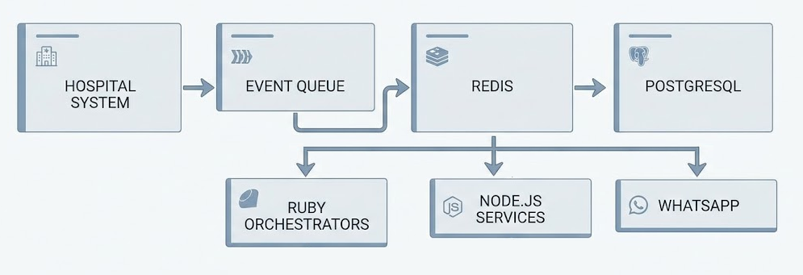
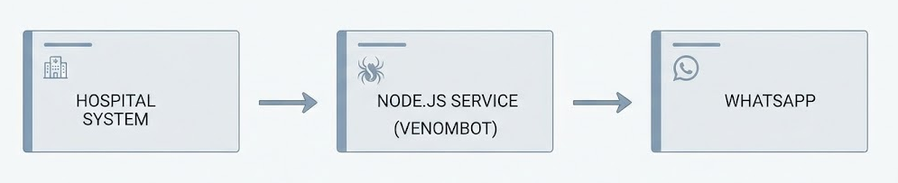

# Healthcare WhatsApp Notification Platform

> **Private Project**
>
> Due to confidentiality agreements, source code, proprietary assets, institution names, and sensitive business information cannot be shared. This document focuses exclusively on the system architecture, engineering decisions, and my technical contributions.

---

## Overview

During the COVID-19 pandemic, minimizing unnecessary in-person interactions became a critical priority for healthcare providers.

To support this objective, I designed and implemented an automated notification platform capable of delivering laboratory results and appointment reminders through WhatsApp.

The project evolved significantly over time, transitioning from a distributed service-oriented architecture to a lightweight, low-maintenance solution while preserving the same business functionality.

---

## Project Scope

The platform automated several patient communication processes, including:

- Laboratory Result Notifications
- Appointment Reminders
- Asynchronous Message Processing
- Automated Delivery Workflows
- Integration with the Hospital Information System

The solution operated independently from the core hospital platform while remaining fully integrated with its clinical workflows.

---

## High-Level Architecture

Initial Distributed Architecture

**Initial Architecture**

- Node.js Services
- PostgreSQL
- Redis
- Event Queue
- Ruby on Rails Orchestrators
- Docker Containers

The first version was designed as a complete messaging ecosystem capable of handling asynchronous processing and service orchestration.

---

## Architecture Evolution

As project priorities evolved after the pandemic, the platform was redesigned with simplicity and operational efficiency as primary objectives.

The new architecture replaced multiple interconnected services with a lightweight Node.js service using VenomBot for WhatsApp automation.

This redesign significantly reduced infrastructure complexity, operational costs, and maintenance effort while maintaining the same business capabilities.

---

## My Contributions

### Solution Architect

- Designed both generations of the platform architecture.
- Evaluated trade-offs between scalability and operational simplicity.
- Planned the migration from a distributed architecture to a lightweight solution.

### Full Stack Developer

- Developed backend services.
- Implemented integrations with the Hospital Information System.
- Automated notification workflows.

### Software Engineer

- Optimized infrastructure for easier maintenance.
- Reduced operational dependencies.
- Improved fault tolerance through architectural simplification.

---

## Key Technical Challenges

- Delivering reliable notifications during a period of exceptionally high demand.
- Designing asynchronous communication workflows.
- Maintaining integration with the Hospital Information System.
- Reducing operational complexity without sacrificing reliability.
- Balancing scalability, maintenance effort, and infrastructure costs.

---

## Technologies

**Languages**

- JavaScript
- SQL

**Backend**

- Node.js
- Ruby on Rails

**Databases**

- PostgreSQL
- Redis

**Infrastructure**

- Docker

**Automation**

- VenomBot

---

## Results

- Successfully automated patient notifications through WhatsApp.
- Reduced manual communication workload for hospital staff.
- Simplified the platform architecture while preserving functionality.
- Lowered infrastructure costs and ongoing maintenance requirements.
- Improved long-term operational reliability through architectural redesign.

---

## Related Case Studies

- 🏥 Enterprise Hospital Information System
- 🔄 Healthcare Data Integration Platform
- 🤖 Clinical RAG Assistant
- 📊 Clinical Risk Prediction Models
