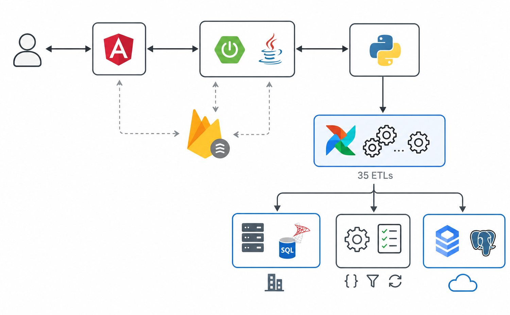
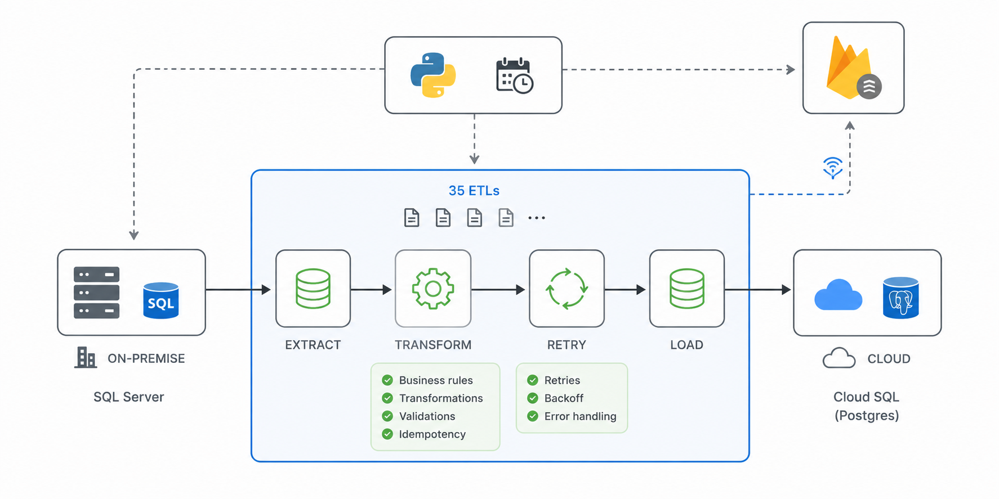

# Enterprise Cloud ETL Modernization

> **Private Project**
>
> Due to confidentiality agreements, source code, proprietary assets, institution names, and sensitive business information cannot be shared. This document focuses exclusively on the system architecture, engineering decisions, and my technical contributions.

---

## Overview

Between 2024 and 2026, I participated in the modernization of a large-scale enterprise data integration process responsible for transferring customer portfolio data from on-premises infrastructure to Google Cloud Platform.

The original process required extensive manual intervention, involved multiple operational teams, and typically took around five days to complete each monthly execution. 

[IMAGE_PLACEHOLDER_01]

Legacy Architecture

SQL Server
      │
      ▼
Manual Transformations
      │
      ▼
PostgreSQL

The objective was to redesign the architecture to significantly reduce execution time while improving reliability, observability, and security.

---

## Project Scope

The modernization included:

- Cloud migration of enterprise ETL/ELT workflows
- Google Dataflow pipelines
- Apache Beam development
- Cloud SQL integration
- Custom orchestration platform
- Automated monitoring
- CI/CD deployment
- DevSecOps compliance

The solution became the new production process for transferring critical business data.

---

## High-Level Architecture

**Solution Architecture**

- On-Premise SQL Server
- Apache Beam Pipelines
- Google Cloud Dataflow
- Cloud SQL (PostgreSQL)
- Custom Java Orchestrator
- Angular Dashboard
- Firestore Event Bus
- Google Cloud Logging

The architecture separated orchestration, monitoring, and data processing into independent services while preserving existing business rules implemented in PostgreSQL.

Architecture for multiple ETL pipelines

[IMAGE_PLACEHOLDER_03]

Monitoring Architecture

Angular UI
      ▲
      │
Firestore Events
      │
      ▼
Java Orchestrator
      │
      ▼
Apache Beam Pipelines
      │
      ▼
Google Dataflow

---

## My Contributions

### Data Engineer

- Designed and implemented Apache Beam pipelines.
- Developed custom Beam transformations.
- Built ETL/ELT workflows for Google Dataflow.
- Implemented idempotent loading strategies.
- Designed intelligent retry mechanisms for unstable source systems.

### Software Engineer

- Developed orchestration components.
- Built monitoring mechanisms between pipelines and the orchestration platform.
- Mentored teammates on Java microservices, Angular, and software design practices.

### Cloud Engineer

- Participated in Google Cloud provisioning.
- Assisted DevSecOps teams with deployment automation.
- Collaborated on secure container image creation using Chainguard as the base image for Apache Beam workers.

---

## Key Technical Challenges

- Migrating a critical enterprise process without disrupting business operations.
- Preserving complex business rules already implemented in PostgreSQL.
- Handling intermittent connectivity issues with on-premises SQL Server.
- Providing real-time monitoring for long-running ETL jobs.
- Meeting strict security requirements identified through DevSecOps vulnerability scanning.
- Coordinating cloud infrastructure provisioning across multiple enterprise teams.

---

## Technologies

**Languages**

- Python
- Java
- SQL
- TypeScript

**Cloud**

- Google Cloud Platform
- Google Dataflow
- Cloud SQL
- Firestore
- Cloud Logging

**Data Engineering**

- Apache Beam
- ETL / ELT
- PostgreSQL
- SQL Server

**Backend**

- Spring Boot
- Angular

**DevOps**

- Azure DevOps
- Docker
- CI/CD
- DevSecOps
- Chainguard

---

## Results

- Reduced the overall monthly data transfer process from approximately **5 days to just over 1 hour**.
- Significantly decreased manual intervention through process automation.
- Improved operational visibility with real-time monitoring.
- Increased reliability through intelligent retry and idempotency mechanisms.
- Successfully deployed the solution following enterprise DevSecOps standards.

---

## Related Case Studies

- 📄 Massive PDF Generation at Scale
- 🛠️ Enterprise Legacy Systems Recovery
