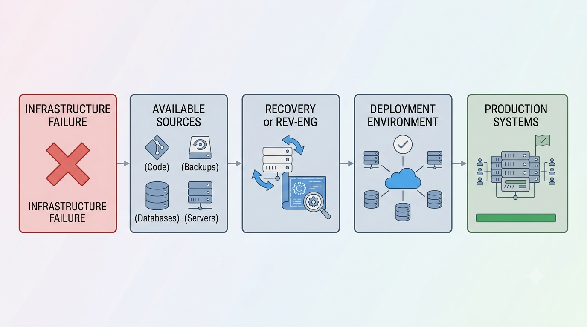

# Enterprise Legacy Systems Recovery

> **Private Project**
>
> Due to confidentiality agreements, source code, proprietary assets, institution names, and sensitive business information cannot be shared. This document focuses exclusively on the system architecture, engineering decisions, and my technical contributions.

---

## Overview

Following a major organizational contingency, the company lost access to a significant portion of its software repositories and deployment infrastructure.

The objective of this initiative was to recover hundreds of business-critical applications, rebuild the development and deployment ecosystem, and restore operational continuity with minimal disruption to business operations.

The project combined software recovery, reverse engineering, infrastructure reconstruction, and modernization efforts across multiple technologies.

---

## Project Scope

The recovery effort included:

- Source code recovery
- Reverse engineering of legacy applications
- Application rebuilding
- Development environment reconstruction
- Git repository migration
- Deployment pipeline restoration
- Production support

The recovered systems supported multiple business areas and represented years of accumulated enterprise development.

---

## High-Level Architecture

**Recovery Workflow**

- Legacy Servers
- Backup Sources
- Recovered Applications
- Version Control
- Build Environment
- Deployment Infrastructure
- Production Systems

Applications were progressively recovered, validated, rebuilt, and redeployed while maintaining business continuity.

---

## My Contributions

### Software Engineer

- Recovered and rebuilt legacy enterprise applications.
- Performed reverse engineering on partially available systems.
- Restored application functionality across multiple technology stacks.
- Fixed compatibility issues introduced by newer runtime environments.

### DevOps Contributor

- Reorganized source code repositories.
- Assisted in rebuilding development environments.
- Participated in deployment automation.
- Restored version control workflows.

### Technical Lead

- Prioritized application recovery according to business impact.
- Coordinated recovery activities across multiple projects.
- Reduced downtime by implementing incremental recovery strategies.

---

## Key Technical Challenges

- Recovering applications with incomplete or outdated source code.
- Reconstructing software architecture from existing binaries and databases.
- Restoring development environments after infrastructure loss.
- Supporting multiple programming languages and frameworks.
- Recovering critical business systems while minimizing service interruptions.

---

## Technologies

**Languages**

- Java
- C#
- PHP
- SQL

**Frameworks**

- Spring Boot
- .NET Framework

**Infrastructure**

- Git
- Windows Server
- Linux
- Docker

**Databases**

- SQL Server
- PostgreSQL

---

## Results

- Successfully recovered and restored hundreds of enterprise applications.
- Rebuilt development and deployment environments following the organizational contingency.
- Reduced business downtime through incremental application recovery.
- Restored version control and deployment workflows.
- Enabled continued maintenance and future modernization of legacy systems.

---

## Related Case Studies

- ☁️ Enterprise Cloud ETL Modernization
- 📄 Massive PDF Generation at Scale
